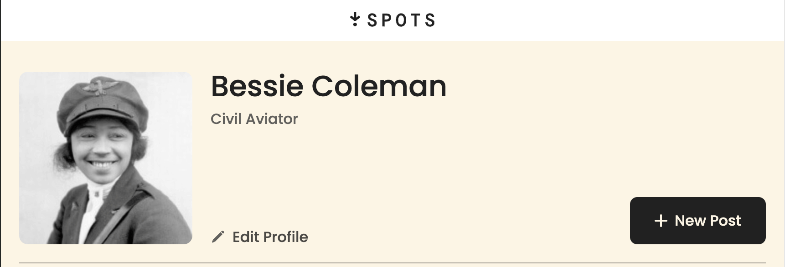
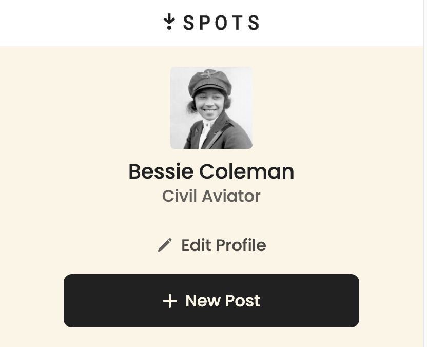
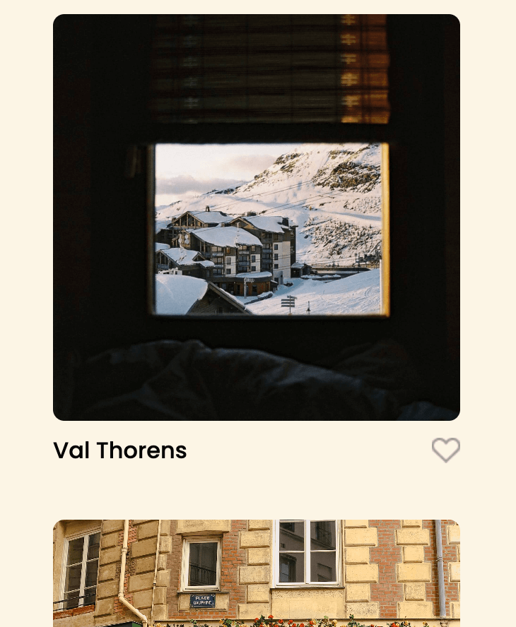

# Project 3: Spots

**Intro**

This project is for an interactive social media photo sharing web application. This page is a profile page of one user and will adapt to various screen dimensions, from desktop to mobile.

**Technologies & Techniques Used**

- HTML
- CSS
- Flexbox
- Grids
- Responsive layouts

Flexbox was used for the profile section and for the individual cards, and grids was used for the overall cards section to give it a more uniform structure and to better adapt to changing screen size dimensions.

**Responsive Features**

- The layout of both the profile grid change from desktop to mobile

_Profile in desktop view_

_Profile in mobile view_

_Grid in desktop view_

_Grid in mobile view_

**Video Submission**

https://drive.google.com/drive/folders/1eS8z79TabTn_4qiHncfOe8HRaCKDZjLk?usp=drive_link

**Link to page**

https://gianni-th.github.io/se_project_spots/
